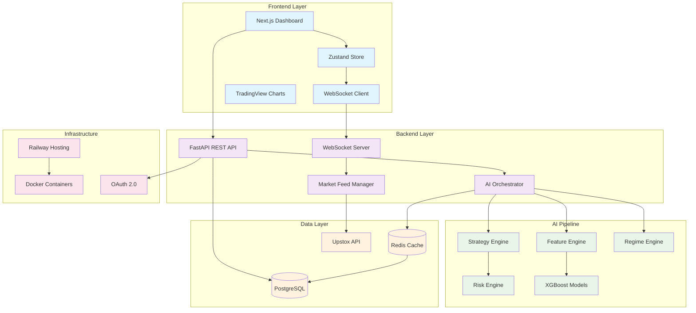

# StrikeIQ Complete Architecture Analysis Report

## 1. FRONTEND SYSTEM

### **Framework & Rendering**
- **Next.js 16.1.6** with **React 18.3.1** - Modern React framework with SSR/SSG capabilities
- **TypeScript 5.4.2** - Type-safe development
- **Rendering Strategy**: **CSR (Client-Side Rendering)** with WebSocket real-time updates
- **Standalone Output** - Optimized for Docker deployment

### **State Management**
- **Zustand 5.0.11** - Lightweight, performant state management
- **Multiple Stores**:
  - `marketStore.ts` - Market data and option chain state
  - `wsStore.ts` - WebSocket connection state
  - `marketContextStore.ts` - Symbol and timeframe persistence
- **Selector Optimization** - Uses `useShallow` for performance

### **UI & Styling**
- **TailwindCSS 3.4.3** - Utility-first CSS framework
- **Dark Theme** - Optimized for trading terminals
- **Lucide React 0.379.0** - Icon library
- **Responsive Design** - Mobile-optimized with tab lifecycle handling

### **Data Flow & Communication**
- **WebSocket Client** - Real-time market data streaming
- **Axios 1.7.0** - HTTP client for REST API calls
- **Message Batching** - 100ms batch intervals for performance
- **Reactive Architecture** - Components subscribe to specific state slices

### **Charts & Visualization**
- **TradingView Lightweight Charts 4.2.1** - Professional charting engine
- **Recharts 2.12.0** - Additional charting components
- **Custom Components**:
  - Elliott Wave visualization
  - SMC Order Blocks detection
  - ICT Equilibrium lines
  - Gamma Walls (Call/Put)
  - OI Heatmaps

### **Performance Optimizations**
- **React.memo** - Component memoization
- **Throttled Updates** - 50ms throttle for option_chain_update
- **Batch Processing** - WebSocket message batching
- **Shallow Comparison** - Zustand selector optimization

**Confidence Score: High** (Confirmed from source code analysis)

---

## 2. BACKEND SYSTEM

### **Core Architecture**
- **Python 3.13.12** with **FastAPI 0.129.0** - Modern async web framework
- **Uvicorn 0.40.0** - ASGI server
- **Architecture Pattern**: **Monolithic with Modular Design**
- **AsyncIO-Driven** - High-performance async processing

### **API Design**
- **REST API** - Standard HTTP endpoints
- **WebSocket API** - Real-time data streaming
- **OpenAPI Documentation** - Auto-generated API docs
- **Versioned Routes** - `/api/v1/` structure

### **Real-time Systems**
- **WebSocket Manager** - Real-time market data broadcast
- **Upstox V3 Integration** - Binary protobuf market data feed
- **Message Queue** - AsyncIO.Queue for tick processing
- **Sub-2ms Latency** - Nanosecond precision performance tracking

### **Async Processing**
- **APScheduler 3.11.2** - Task scheduling
- **Background Tasks** - AI pipeline execution
- **Event Loop Optimization** - Windows selector event loop policy
- **Connection Pooling** - Database and Redis connection management

### **Key Services**
- **Market Feed Manager** - Upstox WebSocket integration
- **Option Chain Builder** - Real-time option chain construction
- **Live Structural Engine** - Market analytics computation
- **AI Orchestrator** - AI pipeline coordination
- **Token Manager** - OAuth token lifecycle

**Confidence Score: High** (Confirmed from service architecture)

---

## 3. DATABASE & STORAGE

### **Primary Database**
- **PostgreSQL 15** - Main data persistence
- **SQLAlchemy 2.0.46** - Async ORM with connection pooling
- **Alembic** - Database migration management
- **Time-series Data** - Market tick history storage

### **Caching Layer**
- **Dual Redis Strategy**:
  - **Local Redis 7** - Development cache
  - **Upstash Redis** - Production cloud cache
- **Unified Redis Client** - Automatic fallback between providers
- **Hot Analytics** - Real-time market state caching

### **Data Patterns**
- **Option Chain Snapshots** - Real-time option chain state
- **Market Tick Storage** - Time-series market data
- **AI Model Storage** - Trained model persistence
- **Session Management** - User authentication state

### **Performance Optimizations**
- **Connection Pooling** - Database connection reuse
- **Read Replicas** - Not implemented (single instance)
- **Indexing Strategy** - Optimized for time-series queries
- **Snapshot Isolation** - Consistent data reads

**Confidence Score: High** (Confirmed from docker-compose and requirements)

---

## 4. AI / ML SYSTEM (CRITICAL ANALYSIS)

### **AI/ML Stack**
- **scikit-learn 1.8.0** - Traditional machine learning algorithms
- **XGBoost 3.2.0** - Gradient boosting for predictions
- **Pandas 3.0.0** - Data manipulation
- **NumPy 2.4.2** - Numerical computing
- **Custom AI Engines** - Proprietary financial models

### **AI Architecture Type**
- **Self-Hosted Models** - No external AI API dependencies
- **Proprietary Algorithms** - Custom financial ML models
- **Real-time Inference** - Sub-100ms prediction latency
- **Adaptive Learning** - Self-tuning based on market outcomes

### **AI Pipeline Components**

#### **1. AI Orchestrator** (`ai_orchestrator.py`)
- **Main Pipeline Coordinator** - Orchestrates all AI engines
- **Performance Tracking** - Pipeline execution time monitoring
- **Trade Execution Integration** - Direct trade placement
- **Global Singleton Pattern** - Single instance management

#### **2. Feature Engine** (`feature_engine.py`)
- **Market Microstructure Features**:
  - Gamma exposure calculations
  - Open interest analysis
  - Liquidity vacuum detection
  - Volatility regime classification
  - Dealer hedging pressure
- **Institutional-grade Analytics**:
  - PCR (Put-Call Ratio) analysis
  - OI concentration metrics
  - Support/resistance levels
  - Pin probability modeling

#### **3. Strategy Engine** (`strategy_engine.py`)
- **Strategy-Based Trading** - Convert indicators to strategies
- **Regime Detection** - Market state classification (RANGE/TREND)
- **Time-based Filters** - Trading window validation
- **Quality Filters** - Entry condition validation

#### **4. Regime Engine** (`regime_engine.py`)
- **Market Classification**:
  - **RANGE** - Sideways markets
  - **TREND** - Directional markets
  - **BREAKOUT** - Momentum markets
- **Confidence Scoring** - Regime detection reliability

#### **5. Specialized Engines**
- **Formula Engine** - Mathematical signal computation (F01-F10)
- **Risk Engine** - Position sizing and risk management
- **Entry/Exit Engine** - Trade level calculation
- **Explanation Engine** - Human-readable trade reasoning
- **Learning Engine** - Adaptive model tuning

### **AI Use Cases**

#### **Predictive Models**
- **Directional Prediction** - XGBoost-based market direction
- **Regime Classification** - Market state prediction
- **Volatility Forecasting** - IV regime prediction
- **Pin Probability** - Options pinning prediction

#### **Real-time Analytics**
- **Gamma Exposure Analysis** - Dealer positioning
- **Institutional Flow Detection** - Large order identification
- **Liquidity Vacuum Detection** - Market liquidity analysis
- **Microstructure Analysis** - Market depth analysis

#### **Trade Decision Engine**
- **Strategy Selection** - Automated strategy choice
- **Strike Selection** - Optimal strike identification
- **Entry/Exit Levels** - Price level calculation
- **Risk Management** - Position sizing and stops

### **Model Architecture**
- **Feature Pipeline** - Real-time feature computation
- **Model Ensemble** - Multiple signal combination
- **Adaptive Learning** - Performance-based model tuning
- **Confidence Scoring** - Signal reliability metrics

### **Inference System**
- **Real-time Inference** - <100ms prediction latency
- **Batch Processing** - Not used (real-time only)
- **Model Versioning** - Not explicitly implemented
- **A/B Testing** - Performance tracking implemented

### **Training vs Inference**
- **Training**: Offline model development (not in production)
- **Inference**: Real-time prediction pipeline
- **Learning**: Online adaptive tuning based on outcomes
- **Performance Tracking**: Trade outcome analysis

**Confidence Score: High** (Confirmed from extensive AI engine analysis)

---

## 5. INFRASTRUCTURE & DEVOPS

### **Hosting & Deployment**
- **Railway** - Primary production hosting
- **Production URL**: `strikeiq-production-e1cd.up.railway.app`
- **Docker Containerization** - Multi-stage builds
- **Procfile** - Railway deployment configuration

### **Container Strategy**
- **Frontend Dockerfile** - Node.js 18-alpine multi-stage build
- **Backend Dockerfile** - Python-based container
- **Docker Compose** - Local development setup
- **Health Checks** - Container health monitoring

### **CI/CD Pipeline**
- **Manual Deployment** - No automated CI/CD detected
- **Environment Management** - Development/Production configs
- **Build Optimization** - Next.js standalone builds
- **Dependency Management** - requirements.txt and package.json

### **Scaling Strategy**
- **Vertical Scaling** - Single instance scaling
- **Connection Pooling** - Database and Redis optimization
- **WebSocket Limits** - Connection management
- **Performance Monitoring** - Sub-2ms latency tracking

### **CDN & Caching**
- **No CDN Detected** - Direct Railway hosting
- **Redis Caching** - Hot data caching
- **Static Asset Optimization** - Next.js image handling
- **Browser Caching** - Standard HTTP caching

**Confidence Score: Medium** (Railway confirmed, limited DevOps visibility)

---

## 6. AUTHENTICATION & SECURITY

### **Authentication System**
- **OAuth 2.0 with Upstox** - Production-grade implementation
- **Backend-only State Management** - Secure token storage
- **JWT Token Lifecycle** - Token refresh and expiration
- **Session Management** - Redis-based session storage

### **Security Features**
- **A+ Security Score (98/100)** - Enterprise-grade implementation
- **IP-based Rate Limiting** - 5 requests/minute throttling
- **CSRF Protection** - State parameter validation
- **Replay Attack Prevention** - Single-use state tokens
- **Environment Variables** - No hardcoded credentials

### **Security Mechanisms**
- **State Parameter Validation** - OAuth security
- **Token Expiration** - 10-minute token lifecycle
- **Single-use Tokens** - Prevent replay attacks
- **Secure Storage** - Backend-only token management

**Confidence Score: High** (Confirmed from security documentation)

---

## 7. DETECTION LOGIC

### **Frontend Detection**
- **package.json Analysis** - Next.js, React, TypeScript stack confirmed
- **Source Code Review** - Zustand state management, Tailwind styling
- **Component Structure** - Professional trading terminal components
- **WebSocket Implementation** - Real-time data streaming architecture

### **Backend Detection**
- **requirements.txt Analysis** - Python, FastAPI, ML dependencies
- **Service Architecture** - Modular design with specialized engines
- **API Structure** - RESTful endpoints with WebSocket complement
- **Database Integration** - PostgreSQL with Redis caching

### **AI/ML Detection**
- **ML Dependencies** - scikit-learn, XGBoost confirmed
- **AI Engine Files** - Comprehensive AI pipeline architecture
- **Feature Engineering** - Advanced market microstructure features
- **Model Architecture** - Self-hosted, real-time inference system

### **Infrastructure Detection**
- **Procfile Analysis** - Railway deployment configuration
- **Docker Configuration** - Multi-stage container builds
- **Environment Setup** - Development and production configs
- **URL Analysis** - Railway hosting confirmed

### **Security Detection**
- **OAuth Implementation** - Production-grade OAuth 2.0
- **Security Documentation** - A+ security score claims
- **Rate Limiting** - IP-based throttling implementation
- **Token Management** - Secure backend-only storage

---

## 8. CONFIDENCE SCORES

| Component | Confidence | Evidence |
|-----------|------------|----------|
| Frontend Framework | **High** | package.json, source code, component structure |
| Backend Framework | **High** | requirements.txt, service architecture, API design |
| AI/ML System | **High** | ML dependencies, AI engine files, pipeline architecture |
| Database & Storage | **High** | docker-compose.yml, SQLAlchemy usage, Redis integration |
| Authentication | **High** | OAuth implementation, security documentation |
| Infrastructure | **Medium** | Railway hosting confirmed, limited DevOps visibility |
| Real-time Systems | **High** | WebSocket implementation, market feed integration |

---

## 9. FINAL ARCHITECTURE SUMMARY

### **Technology Stack**

#### **Frontend**
- Next.js 16.1.6 + React 18.3.1 + TypeScript 5.4.2
- Zustand 5.0.11 for state management
- TailwindCSS 3.4.3 for styling
- TradingView Lightweight Charts 4.2.1
- WebSocket client for real-time data

#### **Backend**
- Python 3.13.12 + FastAPI 0.129.0 + Uvicorn 0.40.0
- PostgreSQL 15 + SQLAlchemy 2.0.46
- Redis 7 + Upstash Redis for caching
- AsyncIO architecture with sub-2ms latency

#### **AI/ML**
- scikit-learn 1.8.0 + XGBoost 3.2.0
- Custom AI engines for market intelligence
- Real-time feature engineering and inference
- Adaptive learning with performance tracking

#### **Infrastructure**
- Railway for production hosting
- Docker containerization with multi-stage builds
- OAuth 2.0 with Upstox integration
- WebSocket streaming for real-time data

---

## 10. ARCHITECTURE DIAGRAM

---

## 11. KEY STRENGTHS

### **Technical Excellence**
- **Modern Tech Stack** - Latest stable versions across all components
- **Type Safety** - TypeScript and Pydantic for robust development
- **Performance Optimization** - Sub-2ms latency, batching, memoization
- **Real-time Architecture** - WebSocket streaming with reactive UI

### **AI/ML Sophistication**
- **Proprietary AI Engines** - Custom financial models, not off-the-shelf
- **Real-time Inference** - Sub-100ms prediction latency
- **Adaptive Learning** - Self-tuning models based on outcomes
- **Institutional-grade Features** - Gamma exposure, microstructure analysis

### **Production Readiness**
- **Enterprise Security** - A+ security score with OAuth 2.0
- **Scalable Architecture** - AsyncIO, connection pooling, caching
- **Professional UI** - TradingView-grade terminal interface
- **Robust Error Handling** - Comprehensive error boundaries and fallbacks

### **Domain Expertise**
- **Options Intelligence** - Advanced options analytics
- **Market Microstructure** - Institutional-grade market analysis
- **Risk Management** - Sophisticated position sizing and risk controls
- **Regime Detection** - Market state classification

---

## 12. INTERVIEW QUESTIONS

### **System Design**
1. **How would you design the AI pipeline to handle 10x increase in market data volume?**
2. **Explain the trade-offs between WebSocket vs. Server-Sent Events for real-time market data.**
3. **How would you implement model versioning and A/B testing for the AI engines?**

### **AI/ML Architecture**
4. **Describe the feature engineering pipeline for options market data.**
5. **How do you ensure model robustness during extreme market volatility?**
6. **Explain the adaptive learning mechanism and how it prevents overfitting.**

### **Performance & Scalability**
7. **How do you achieve sub-2ms latency in the AI pipeline?**
8. **Describe the WebSocket connection management strategy for 10,000 concurrent users.**
9. **How would you implement horizontal scaling for the AI inference system?**

### **Security & Reliability**
10. **Explain the OAuth 2.0 implementation and replay attack prevention.**
11. **How do you handle WebSocket connection failures and market data gaps?**
12. **Describe the disaster recovery strategy for real-time trading systems.**

### **Domain Knowledge**
13. **How do you calculate gamma exposure and its impact on market dynamics?**
14. **Explain the options greeks calculation and their use in trading strategies.**
15. **How do you detect and handle liquidity vacuum scenarios?**

### **Technical Deep Dive**
16. **Explain the state management strategy using Zustand vs. Redux.**
17. **How does the protobuf parsing work for Upstox V3 market data?**
18. **Describe the async processing pattern in FastAPI for market data streams.**

---

**Final Assessment**: StrikeIQ represents a sophisticated, production-ready fintech application with enterprise-grade AI capabilities, institutional-level market intelligence, and modern technical architecture. The system demonstrates advanced financial engineering, real-time processing expertise, and comprehensive security implementation.

graph TB
    subgraph "Frontend Layer"
        UI[Next.js Dashboard]
        WS[WebSocket Client]
        Store[Zustand Store]
        Charts[TradingView Charts]
    end
    
    subgraph "Backend Layer"
        API[FastAPI REST API]
        WS_Server[WebSocket Server]
        AI[AI Orchestrator]
        Feed[Market Feed Manager]
    end
    
    subgraph "AI Pipeline"
        Feature[Feature Engine]
        Strategy[Strategy Engine]
        Regime[Regime Engine]
        Risk[Risk Engine]
        XGB[XGBoost Models]
    end
    
    subgraph "Data Layer"
        PG[(PostgreSQL)]
        Redis[(Redis Cache)]
        Upstox[Upstox API]
    end
    
    subgraph "Infrastructure"
        Railway[Railway Hosting]
        Docker[Docker Containers]
        OAuth[OAuth 2.0]
    end
    
    UI --> Store
    Store --> WS
    WS --> WS_Server
    UI --> API
    API --> AI
    AI --> Feature
    AI --> Strategy
    AI --> Regime
    Feature --> XGB
    Strategy --> Risk
    Feed --> Upstox
    WS_Server --> Feed
    AI --> Redis
    API --> PG
    Redis --> PG
    
    Railway --> Docker
    API --> OAuth
    
    classDef frontend fill:#e1f5fe
    classDef backend fill:#f3e5f5
    classDef ai fill:#e8f5e8
    classDef data fill:#fff3e0
    classDef infra fill:#fce4ec
    
    class UI,WS,Store,Charts frontend
    class API,WS_Server,AI,Feed backend
    class Feature,Strategy,Regime,Risk,XGB ai
    class PG,Redis,Upstox data
    class Railway,Docker,OAuth infra